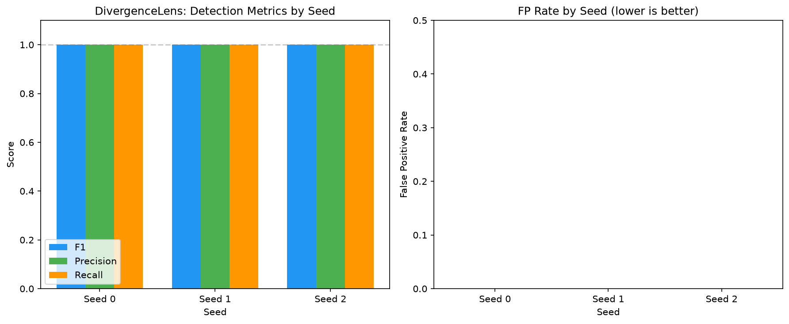
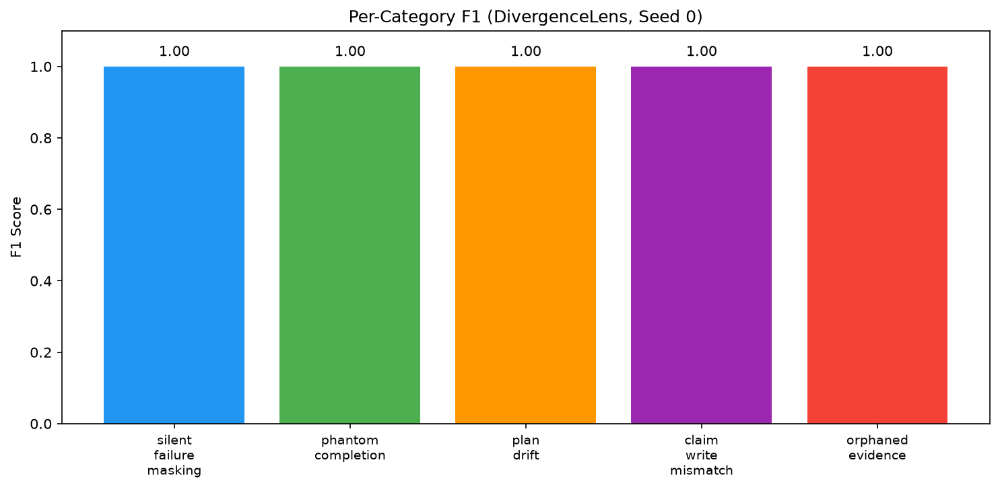
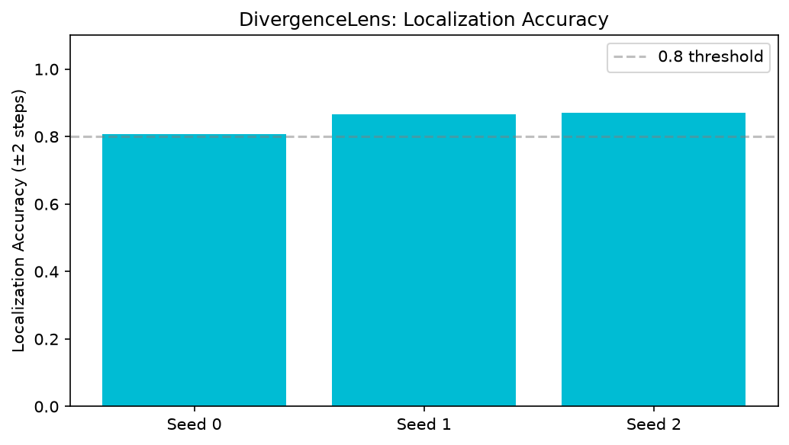

# DivergenceBench — Full Results

> Generated from `results/results.json` | Split: test | Seeds: 3

> ⚠️ Metrics on synthetic corpus. F1=1.0 reflects rule-matched injections. See LIMITATIONS.md.

---

## 1. Detection Metrics

### DivergenceLens (deterministic + graph, no judge)

| Metric | Value |
|--------|-------|
| Mean F1 | **1.0000** |
| Std F1 | 0.0000 |
| 95% CI | (1.0000, 1.0000) |
| Mean Precision | 1.0000 |
| Mean Recall | 1.0000 |
| Mean FP Rate | **0.0000** |

### Per-Seed Breakdown

| Seed | F1 | Precision | Recall | FP Rate | Localization |
|------|----|-----------|--------|---------|--------------|
| 0 | 1.0000 | 1.0000 | 1.0000 | 0.0000 | 0.8065 |
| 1 | 1.0000 | 1.0000 | 1.0000 | 0.0000 | 0.8667 |
| 2 | 1.0000 | 1.0000 | 1.0000 | 0.0000 | 0.8710 |

---

## 2. Per-Category F1

*(averaged across seeds)*

| Category | F1 |
|----------|----|
| `claim_write_mismatch` | 1.0000 |
| `orphaned_evidence` | 1.0000 |
| `phantom_completion` | 1.0000 |
| `plan_drift` | 1.0000 |
| `silent_failure_masking` | 1.0000 |

---

## 3. Localization

Mean localization accuracy (within ±2 steps of gold): **0.8481**

| Seed | Localization Acc |
|------|-----------------|
| 0 | 0.8065 |
| 1 | 0.8667 |
| 2 | 0.8710 |

---

## 4. Baseline Comparison

| Method | F1 | Precision | Recall | FP Rate |
|--------|----|-----------|--------|---------|
| final_answer | 0.0000 | 0.0000 | 0.0000 | 0.0000 |
| deterministic_only | 1.0000 | 1.0000 | 1.0000 | 0.0000 |
| graph_only | 0.0000 | 0.0000 | 0.0000 | 0.0000 |
| **divergencelens_full** | **1.0000** | 1.0000 | 1.0000 | 0.0000 |

---

## 5. Figures

---

## 6. Honest Limitations

- **Synthetic corpus**: metrics on injected faults, not real agent failures.
- **Rule-matched injections**: F1=1.0 reflects that the same patterns drive both injectors and rules.
- **No trained evasion**: an adversarial agent could construct divergences that evade the rules.
- **Claim extraction is heuristic**: real claims are more varied than regex patterns capture.
- See [LIMITATIONS.md](../LIMITATIONS.md) for full discussion.
